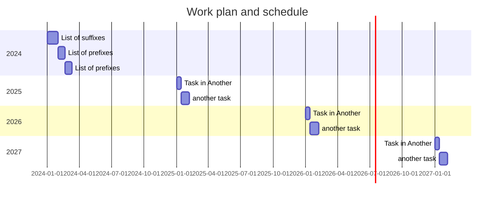

[Main page](README.md)

# Progress

```mermaid
gantt
    title Work plan and schedule
    dateFormat DD-MM-YYYY

    section 2024
        List of suffixes          :a1, 01-01-2024, 30d
        List of prefixes    :a2, after a1, 20d
        List of prefixes    :after a2, 20d
section 2025
        Task in Another :01-01-2025, 12d
        another task    :24d

section 2026

        Task in Another :01-01-2026, 12d
        another task    :24d

section 2027

        Task in Another :01-01-2027, 12d
        another task    :24d

```

# Task list

- [ ] List of suffixes
- [ ] List of prefixes
- [ ] Tagging of suffixes
- [ ] Tagging of prefixes
- [ ] 