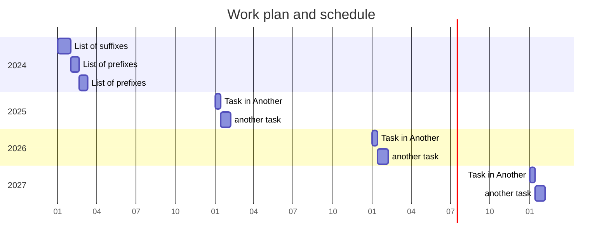

[Main page](README.md)

# Task list

1. [ ] Splitting of complex lemmata.
1. [ ] Adding new lemmata.
1. [ ] Adding proper names.
1. [ ] Extraction of already tagged information. 
1. [ ] List of suffixes
1. [ ] Tagging of suffixes
1. [ ] List of prefixes
1. [ ] Tagging of prefixes
1. [ ] Addition of word class
1. [ ] Addition of gender.
1. [ ] Addition of acent.
1. [ ] Adding word root
1. [ ] Inclusion of Bases for each lemma
1. [ ] Composita
1. [ ] Word families
- [ ] 
- [ ] 

---

# Progress

