- [Word Formation in Ancient Greek](#word-formation-in-ancient-greek)
  - [Introduction](#introduction)
  - [Database](#database)
  - [Tagging](#tagging)
  - [Data extraction](#data-extraction)
  - [Graphics](#graphics)
  - [Video presentation](#video-presentation)
  - [Word families](#word-families)
  - [Some references](#some-references)

---

# Word Formation in Ancient Greek

---
## Introduction

1. This is the site of the Project “Word Formation in Ancient Greek”.
2. The purpose of this project is to create a new handbook of Word Formation in the footsteps of Debrunner and Risch.
3. This site is under construction.
 

---
## Database

1. The nucleus of the project is a **database** containing the **Liddle-Scott-Jones Dictionary** provided by the Perseus Project. 
2. The LSJ has been take from **Celano**'s  [Unicode LSJ](https://github.com/gcelano/LSJ_GreekUnicode)
3. This dictionary contains 116.500 lemmata.
4. The information is encoded in xml.
   

---
## Tagging

1. Each lemma is tagged for the following information:
    - Segmentation
    - Word class
    - Suffixes
    - Prefixes.
    - Infixes.
    - Gender
    - Accent
    - Family root
    - ...
2. The tagging is both manual and automatic.
3. Structure of the DB (partial information):
   

---
## Data extraction

1. Many of the processes are automatized taking as starting point the manually tagging.
2. The derivation of each lemma is extracted automatically, once the first base of each lemma has been manually established:

3. This [vídeo](https://youtu.be/Sstu_yzQYnk) shows the automatic extraction.

---

## Graphics

1. The database allows the automatical creation of graphics representing the derivation of each lemma.
2. The graphics are created in Markdown using [Mermaid](https://mermaid.js.org). 

3. The following image (svg) depicts a provisional representation of the word family πείθω (‘to persuade’):

---

## Video presentation

This Youtube [video](https://youtu.be/Akyy7MvAdGc) offers a glimpse of the project in two minutes.

---

## Word families

1. This link leads to some provisional graphics representing [word families](Word_Families.md).
2. These graphics are just meant as teaching material.

---
## Some references

1. Debrunner A. (1917). *Griechische Wortbildungslehre*. C. Winter.
2. Emde Boas E. van. (2019). *The Cambridge Grammar of Classical Greek*. Cambridge University Press.
3. Risch E. (1937). *Wortbildung der Homerischen Sprache*. W. de Gruyter.
