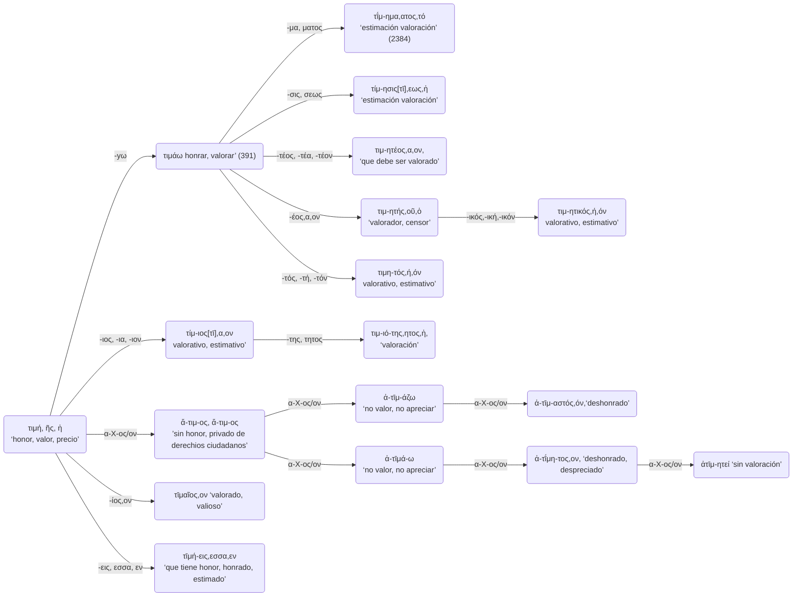

```mermaid

graph LR

timh("τιμή, ῆς, ἡ<br>‘honor, valor, precio’")
timaw("τιμάω honrar, valorar’ (391)")
timhma("τῑ́μ-ημα,ατος,τό<br>‘estimación valoración’ (2384)")
timhsis("τίμ-ησις[τῑ],εως,ἡ<br>‘estimación valoración’")
timhteos("τιμ-ητέος,α,ον,<br>‘que debe ser valorado’")
timhths("τιμ-ητής,οῦ,ὁ<br>‘valorador, censor’")
timhtikos("τιμ-ητικός,ή,όν<br>valorativo, estimativo’")
timhtos("τιμη-τός,ή,όν<br>valorativo, estimativo’")
timios("τίμ-ιος[τῑ],α,ον<br>valorativo, estimativo’")
timioths("τιμ-ιό-της,ητος,ἡ,<br>‘valoración’")
atimos("ἄ-τιμ-ος, ἄ-τιμ-ος<br>’sin honor, privado de derechios ciudadanos’")
timaios("τῑμαῖος,ον ‘valorado, valioso’")

timheis("τῑμή-εις,εσσα,εν<br>‘que tiene honor, honrado, estimado’")
atimazw("ἀ-τῑμ-άζω<br>‘no valor, no apreciar’")
atimaw("ἀ-τῑμά-ω<br>‘no valor, no apreciar’")
atimastos("ἀ-τῑμ-αστός,όν,‘deshonrado’")
atimhtos("ἀ-τῑ́μη-τος,ον, ‘deshonrado, despreciado’")
atimhtei("ἀτῑμ-ητεί ‘sin valoración’")

timh-->|-yω|timaw
timaw-->|-μα, ματος|timhma
timaw-->|-σις, σεως|timhsis
timaw-->|-τέος, -τέα, -τέον|timhteos
timaw-->|-τός, -τή, -τόν|timhtos
timaw-->|-έος,α,ον|timhths
timhths-->|-ικός,-ική,-ικόν|timhtikos
timh-->|-ιος, -ια, -ιον|timios
timh-->|α-X-ος/ον|atimos
atimos-->|α-X-ος/ον|atimazw
atimazw-->|α-X-ος/ον|atimastos
atimos-->|α-X-ος/ον|atimaw
atimaw-->|α-X-ος/ον|atimhtos
atimhtos-->|α-X-ος/ον|atimhtei
timh-->|-ίος,ον|timaios
timios-->|-της, τητος|timioths
timh-->|-εις, εσσα, εν|timheis

```