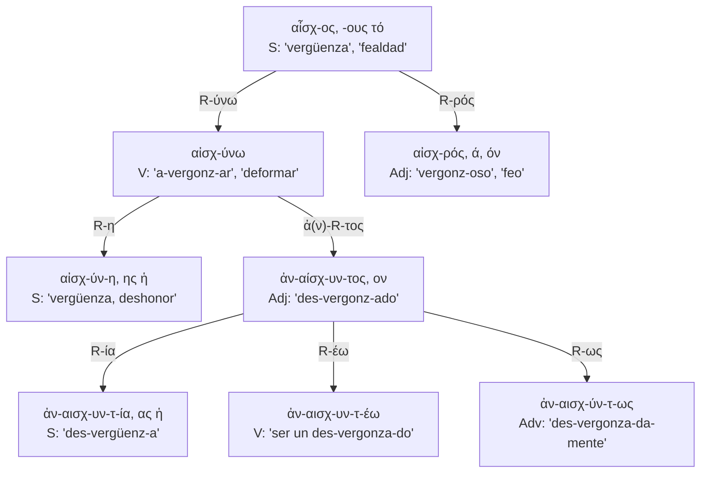

- [αἶσχος](#αἶσχος)
- [δίκη](#δίκη)
- [πωλέω](#πωλέω)
- [Markdown](#markdown)

---

# αἶσχος

# δίκη

# πωλέω

# Markdown

```mermaid
graph TB

  A["αἶσχ-ος, -ους τό<br>S: 'vergüenza', 'fealdad'"] --"R-ύνω"--> B["αἰσχ-ύνω <F-942><br>V: 'a-vergonz-ar', 'deformar'"]
   
  A --"R-ρός"--> C["αἰσχ-ρός, ά, όν <F-381><br>Adj: 'vergonz-oso', 'feo'"]
  B --"R-η"-->  D["αἰσχ-ύν-η, ης ἡ <F-1732><br>S: 'vergüenza, deshonor'"]
  B --"ἀ(ν)-R-τος"-->  E["ἀν-αίσχ-υν-τος, ον <F-4130><br>Adj: 'des-vergonz-ado'"]
  E --"R-ία"-->  F["ἀν-αισχ-υν-τ-ία, ας ἡ <F-4671><br>S: 'des-vergüenz-a'"]
  E --"R-έω"--> G["ἀν-αισχ-υν-τ-έω<br>V: 'ser un des-vergonza-do'"]
  E --"R-ως"--> H["ἀν-αισχ-ύν-τ-ως<br>Adv: 'des-vergonza-da-mente'"]
          
  
```
