[Main page](README.md)
---
- [αἶσχος](#αἶσχος)
  - [Graphic](#graphic)
  - [Mermaid code](#mermaid-code)
- [δίκη](#δίκη)
- [μανθάνω](#μανθάνω)
- [πεἰθω](#πεἰθω)
- [πωλέω](#πωλέω)
- [ψεύδ-](#ψεύδ-)

---
These figures are just provisional drafts and will be changed and improved along the time.
# αἶσχος

## Graphic



## Mermaid code

~~~
{
  ```mermaid

graph TB

A["αἶσχ-ος, -ους τό<F-942><br>S: 'vergüenza', 'fealdad'"]  
B["αἰσχ-ύνω <F-942><br>V: 'a-vergonz-ar',  'deformar'"]
C["αἰσχ-ρός, ά, όν <F-381><br>Adj:  'vergonz-oso', 'feo'"]
D["αἰσχ-ύν-η, ης ἡ <F-1732><br>S: 'vergüenza,   deshonor'"]
E["ἀν-αίσχ-υν-τος, ον <F-4130><br>Adj:   'des-vergonz-ado'"]
F["ἀν-αισχ-υν-τ-ία, ας ἡ <F-4671><br>S:   'des-vergüenz-a'"]
G["ἀν-αισχ-υν-τ-έω<br>V: 'ser un  des-vergonza-do'"]
H["ἀν-αισχ-ύν-τ-ως<br>Adv:  'des-vergonza-da-mente'"]

A--"R-ύνω"--> B
A --"R-ρός"--> C
B --"R-η"-->  D
B --"ἀ(ν)-R-τος"--> E
E --"R-ία"-->  F
E --"R-έω"--> G
E --"R-ως"--> H

``` 
}
~~~

---

# δίκη


---

# μανθάνω



---

# πεἰθω


# πωλέω


# ψεύδ-


